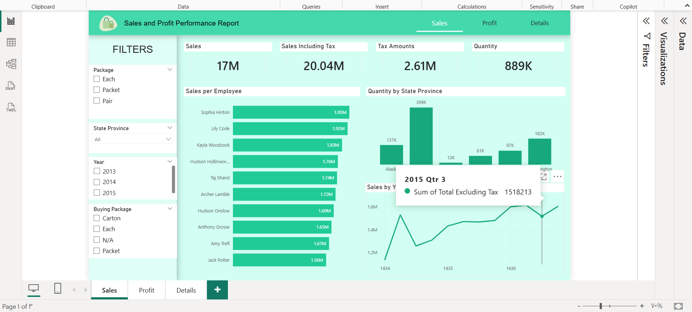
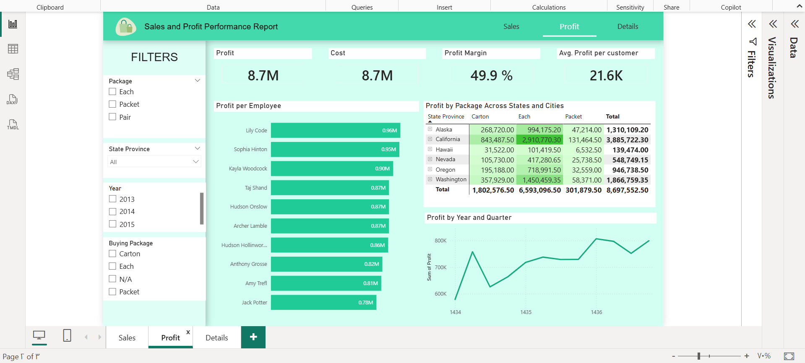

# Sales_profit_analysis_PBi
Sales &amp; Profit Analysis Dashboard in Power BI showing sales performance, profit metrics, and key business insights across regions and employees.

# Sales & Profit Analysis Dashboard - Power BI

## Project Overview
This project is a **Power BI dashboard** focused on analyzing sales and profit data to provide actionable insights for business decision-making. The dashboard covers various dimensions including sales performance, profit analysis, and efficiency metrics across different regions, employees, and products.

The project was built to answer key business questions and measure performance effectively.

## Scope

### Sales Analysis
- **Sales Performance by Year and Quarter**: Track overall sales trends over time.
- **Total Sold Quantity by State and City**: Understand sales distribution geographically.
- **Sales by Each Salesperson**: Evaluate individual performance.

### Profit Analysis
- **Profit Performance Over Years**: Analyze profit growth trends.
- **Profit per Employee**: Measure profitability contribution by staff.
- **Profit by Package Across States and Cities**: Identify which packages generate higher profit in different locations.

## Key Measures
- **Average Profit per Customer**
- **Cost**
- **Profit Margin**
- **Average Delivery Days**

## Features
- Interactive dashboards with filters by year, quarter, region.
- Visualizations for both sales and profit performance.
- Insights for improving sales strategies and profitability.
- Easy-to-read charts, tables, and KPIs for decision-makers.

## Tools & Technologies
- **Power BI Desktop**: Data modeling, visualization, and dashboard creation.
- **Excel / CSV**: Source data.
- **Power Query**: Data cleaning and transformation.

## How to Use
1. Clone or download this repository.
2. Open the `.pbix` Power BI file in **Power BI Desktop**.
3. Explore the interactive visuals and filters to analyze sales and profit.

## Dashboards

An interactive Power BI project analyzing sales, profit, and detailed transaction data to support business decision-making and performance monitoring.

## License
This project is for educational purposes. Feel free to use and modify it for learning and analysis.

